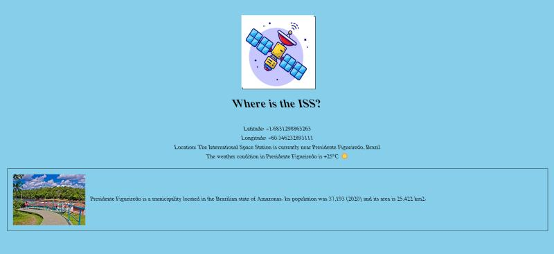

# Where is the ISS?

This project provides real-time information about the International Space Station (ISS) location, weather conditions at its current position, and a brief information of said location.

## Description

This web application fetches data from two APIs to display the current latitude and longitude of the ISS along with its location and nearby weather conditions.

## Features

- Displays the latitude and longitude coordinates of the ISS.
- Determines the location of the ISS using reverse geocoding.
- Retrieves weather conditions of the ISS location using the `wttr.in` API.
- Provides brief description of ISS location using Beautiful Soup library.

## Preview

## How to Use

1. Clone this repository.
2. Start python app.py in command prompt.
3. Open `http://localhost:5000/` in a web browser.
4. The webpage will display the current latitude and longitude of the ISS along with its location, weather conditions and brief description.

## Credits

- **ISS Location Data**: [wheretheiss.at](https://wheretheiss.at/)
- **Reverse Geocoding**: [BigDataCloud](https://www.bigdatacloud.com/)
- **Weather Information**: [wttr.in](https://github.com/chubin/wttr.in)
- **Webscraping Tool**: [BeautifulSoup](https://beautiful-soup-4.readthedocs.io/en/latest/)

## License

This project is licensed under the MIT License - see the [LICENSE](LICENSE) file for details.
